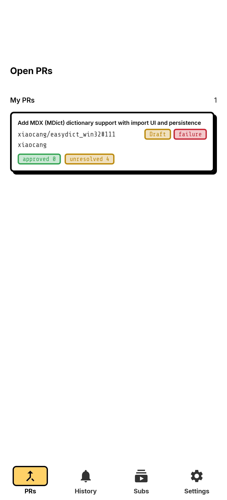
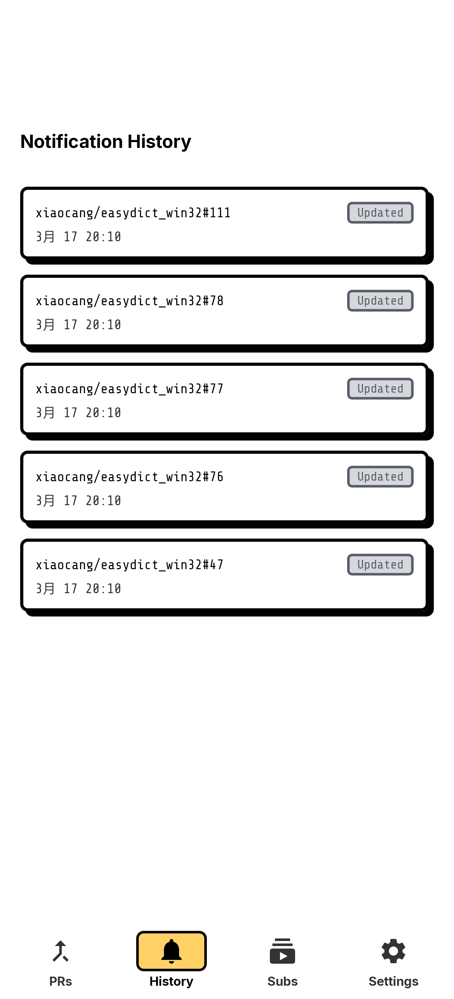
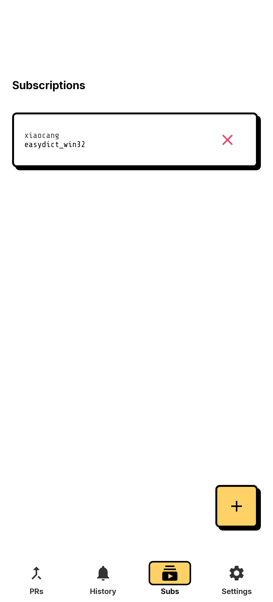
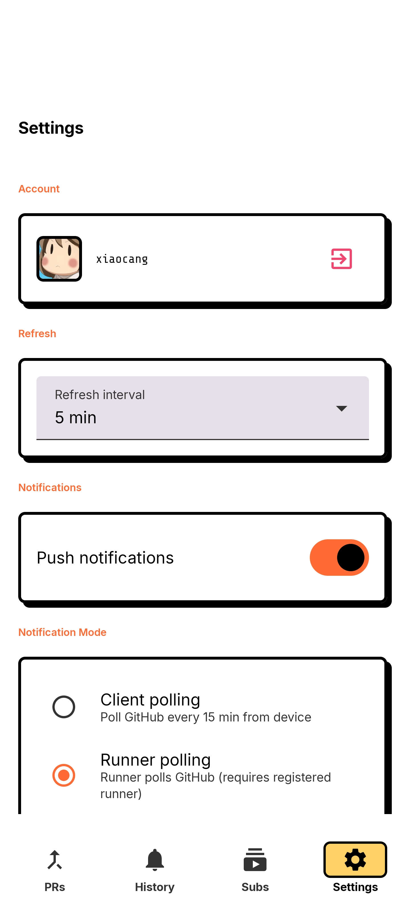

# GHPr

GitHub PR notification system — get push notifications on your phone when PRs you care about are updated.

## Screenshots

| PRs | History |
|-----|---------|
|  |  |

| Subscriptions | Settings |
|---------------|----------|
|  |  |

## Features

- Real-time push notifications for PR events (reviews, comments, status checks, merges)
- Subscribe to specific repositories
- CI retry commands from your phone (with self-hosted runner support)
- Lightweight backend on Cloudflare Workers (free tier friendly)

## Architecture

```
GitHub ──webhook──▶ Server (CF Worker + D1) ──FCM──▶ Android App
                         ▲
                    Runner (CF Worker or native) ── runs CI retry commands
```

| Component | Path | Stack |
|-----------|------|-------|
| Android app | `android/` | Kotlin, Jetpack Compose |
| Push server | `server/` | Cloudflare Workers, D1, TypeScript |
| CI runner (worker) | `worker-runner/` | Cloudflare Workers, TypeScript |

## Getting started

### 1. Download the app

Grab the latest APK from [Releases](https://github.com/xiaocang/ghpr-mobile/releases).

To build from source, see [`android/README.md`](android/README.md).

### 2. Deploy a runner (optional)

The runner enables CI retry commands from the app. It points to the official server by default.

```bash
cd worker-runner
npm install
npx wrangler secret put GITHUB_TOKEN
npx wrangler secret put RUNNER_TOKEN
npx wrangler deploy
```

### 3. Self-host the server (optional)

If you want to run your own server instance, see [`server/README.md`](server/README.md) for deployment instructions.

## Development

```bash
# Server local dev
cd server && npm run dev

# Worker runner local dev
cd worker-runner && npm run dev

# Server tests
cd server && npm test
```

## License

MIT
